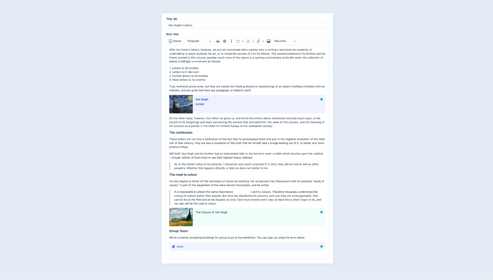
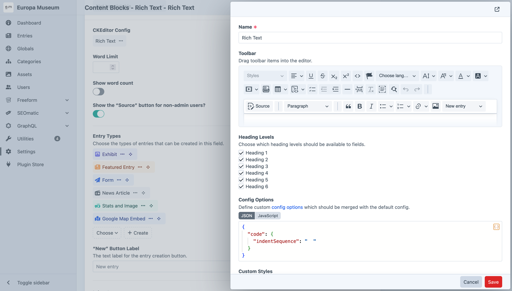
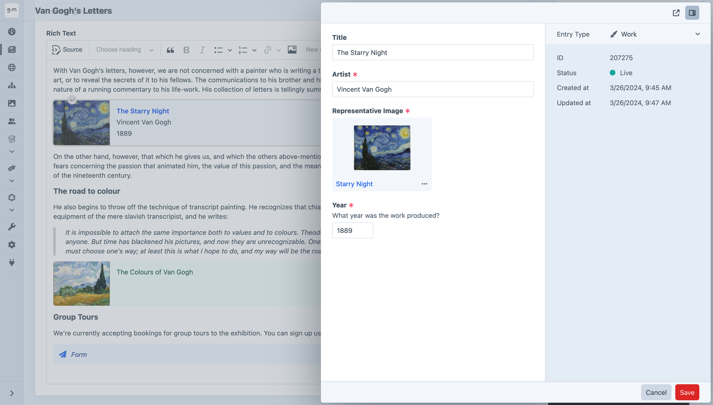

<p align="center"></p>

<h1 align="center">CKEditor</h1>

This plugin adds a “CKEditor” field type to Craft CMS, which provides a deeply-integrated rich text and longform content editor, powered by [CKEditor 5](https://ckeditor.com/).



**Table of Contents:**

- [Requirements](#requirements)
- [Installation](#installation)
- [Configuration](#configuration)
  - [Registering Custom Styles](#registering-custom-styles)
  - [HTML Purifier Configs](#html-purifier-configs)
  - [Embedding Media](#embedding-media)
- [Longform Content with Nested Entries](#longform-content-with-nested-entries)
  - [Setup](#setup)
  - [Rendering Nested Entries on the Front End](#rendering-nested-entries-on-the-front-end)
- [Converting Redactor Fields](#converting-redactor-fields)
- [Adding CKEditor Plugins](#adding-ckeditor-plugins)

## Requirements

This plugin requires Craft CMS 5.2.0 or later.

## Installation

You can install this plugin from Craft’s in-app Plugin Store or with Composer.

**From the Plugin Store:**

Go to the Plugin Store in your project’s Control Panel and search for “CKEditor,” then click on the “Install” button in the sidebar.

**With Composer:**

Open your terminal and run the following commands:

```bash
# go to the project directory
cd /path/to/my-project

# tell Composer to load the plugin
composer require craftcms/ckeditor

# tell Craft to install the plugin
php craft plugin/install ckeditor
```

## Configuration

CKEditor configs are managed globally from **Settings** → **CKEditor**.

Configurations define the available toolbar buttons, as well as any custom [config options](https://ckeditor.com/docs/ckeditor5/latest/api/module_core_editor_editorconfig-EditorConfig.html) and CSS styles that should be registered with the field.

New configs can also be created inline from CKEditor field settings.



### Registering Custom Styles

CKEditor’s [Styles](https://ckeditor.com/docs/ckeditor5/latest/features/style.html) plugin makes it easy to apply custom styles to your content via CSS classes.

You can define custom styles within CKEditor configs using the [`style`](https://ckeditor.com/docs/ckeditor5/latest/api/module_core_editor_editorconfig-EditorConfig.html#member-style) config option:

```js
return {
  style: {
    definitions: [
      {
        name: 'Tip',
        element: 'p',
        classes: ['note']
      },
      {
        name: 'Warning',
        element: 'p',
        classes: ['note', 'note--warning']
      },
    ]
  }
}
```

You can then register custom CSS styles that should be applied within the editor when those styles are selected:

```css
.ck.ck-content p.note {
    border-left: 4px solid #4a7cf6;
    padding-left: 1rem;
    color: #4a7cf6;
}

.ck.ck-content p.note--warning {
    border-left-color: #e5422b;
    color: #e5422b;
}
```

### HTML Purifier Configs

CKEditor fields use [HTML Purifier](http://htmlpurifier.org) to ensure that no malicious code makes it into its field values, to prevent XSS attacks and other vulnerabilities.

You can create custom HTML Purifier configs that will be available to your CKEditor fields. They should be created as JSON files in your `config/htmlpurifier/` folder.

Use this as a starting point, which is the default config that CKEditor fields use if no custom HTML Purifier config is selected:

```json
{
  "Attr.AllowedFrameTargets": [
    "_blank"
  ],
  "Attr.EnableID": true
}
```

See the [HTML Purifier documentation](http://htmlpurifier.org/live/configdoc/plain.html) for a list of available config options.

For advanced customization, you can modify the `HTMLPurifier_Config` object directly via the `craft\ckeditor\Field::EVENT_MODIFY_PURIFIER_CONFIG` event.

```php
use craft\htmlfield\events\ModifyPurifierConfigEvent;
use craft\ckeditor\Field;
use HTMLPurifier_Config;
use yii\base\Event;

Event::on(
    Field::class,
    Field::EVENT_MODIFY_PURIFIER_CONFIG,
    function(ModifyPurifierConfigEvent $event) {
        /** @var HTMLPurifier_Config $config */
        $config = $event->config;
        // ...
    }
);
```

### Embedding Media

CKEditor 5 stores references to embedded media embeds using `oembed` tags. Craft CMS configures HTML Purifier to support these tags, however you will need to ensure that the `URI.SafeIframeRegexp` HTML Purifier setting is set to allow any domains you wish to embed content from. 

See CKEditor’s [media embed documentation](https://ckeditor.com/docs/ckeditor5/latest/features/media-embed.html#displaying-embedded-media-on-your-website) for examples of how to show the embedded media on your front end.

## Longform Content with Nested Entries

CKEditor fields can be configured to manage nested entries, which will be displayed as [cards](https://craftcms.com/docs/5.x/system/elements.html#chips-cards) within your rich text content, and edited via [slideouts](https://craftcms.com/docs/5.x/system/control-panel.html#slideouts).



Nested entries can be created anywhere within your content, and they can be moved, copied, and deleted, just like images and embedded media.

### Setup

To configure a CKEditor field to manage nested entries, follow these steps:

1. Go to **Settings** → **Fields** and click on your CKEditor field’s name (or create a new one).
2. Double-click on the selected CKEditor config to open its settings.
3. Drag the “New entry” menu button into the toolbar, and save the CKEditor config.
4. Back on the field’s settings, select one or more entry types which should be available within CKEditor fields.
5. Save the field’s settings.

Now the field is set up to manage nested entries! The next time you edit an element with that CKEditor field, the “New entry” menu button will be shown in the toolbar, and when you choose an entry type from it, a slideout will open where you can enter content for the nested entry.

An entry card will appear within the rich text content after you press **Save** within the slideout. The card can be moved via drag-n-drop or cut/paste from there.

You can also copy/paste the card to duplicate the nested entry.

To delete the nested entry, simply select it and press the **Delete** key.

> [!NOTE]  
> Copy/pasting entry cards across separate CKEditor fields is not supported.

### Rendering Nested Entries on the Front End

On the front end, nested entries will be rendered automatically via their [partial templates](https://craftcms.com/docs/5.x/system/elements.html#rendering-elements).

For each entry type selected by your CKEditor field, create a `_partials/entry/<entryTypeHandle>.twig` file within your `templates/` folder, and place your template code for the entry type within it.

An `entry` variable will be available to the template, which references the entry being rendered.

> [!TIP]
> If your nested entries contain any relation fields, you can eager-load their related elements for each of the CKEditor field’s nested entries using [`eagerly()`](https://craftcms.com/docs/5.x/development/eager-loading.html#lazy-eager-loading).
> 
> ```twig
> 
> ```

### Rendering Chunks

CKEditor field content is represented by an object that can be output as a string (`{{ entry.myCkeditorField }}`), or used like an array:

```twig

  <div class="chunk {{ chunk.type }}">
    {{ chunk }}
  </div>

```

“Chunks” have two `type`s: `markup`, containing CKEditor HTML; and `entry`, representing a single nested entry. Adjacent markup chunks are collapsed into one another in cases where the nested entry is disabled.

This example treats both chunk types as strings. For entry chunks, this is equivalent to calling `{{ entry.render() }}`. If you would like to customize the data passed to the element partial, or use a different representation of the entry entirely, you have access to the nested entry via `chunk.entry`:

```twig

  
    <div class="chunk markup">
      {{ chunk }}
    </div>
  
    <div class="chunk entry" data-entry-id="{{ chunk.entry.id }}">
      {# Call the render() method with custom params... #}
      {{ chunk.entry.render({
        isRss: true,
      }) }}

      {# ...or provide completely custom HTML for each supported entry type! #}
      
        
          
          
            <figure>
              {# ... #}
            </figure>
        
          

          <a href="{{ doc.url }}" download>Download {{ doc.filename }}</a> ({{ doc.size|filesize }})
        
          {# For anything else: #}
          {{ chunk.entry.render() }}
      
    </div>
  

```

## Converting Redactor Fields

You can used the `ckeditor/convert` command to convert any existing Redactor fields over to CKEditor. For each unique Redactor config, a new CKEditor config will be created.

```sh
php craft ckeditor/convert
```

## Adding CKEditor Plugins

Craft CMS plugins can register additional CKEditor plugins to extend its functionality.

The first step is to create a [DLL-compatible](https://ckeditor.com/docs/ckeditor5/latest/installation/advanced/alternative-setups/dll-builds.html) package which provides the CKEditor plugin(s) you wish to add.

- If you’re including one of CKEditor’s [first-party packages](https://github.com/ckeditor/ckeditor5/tree/master/packages), it will already include a `build` directory with a DLL-compatible package inside it.
- If you’re creating a custom CKEditor plugin, use [CKEditor’s package generator](https://ckeditor.com/docs/ckeditor5/latest/framework/plugins/package-generator/using-package-generator.html) to scaffold it, and run its [`dll:build` command](https://ckeditor.com/docs/ckeditor5/latest/framework/plugins/package-generator/javascript-package.html#dllbuild) to create a DLL-compatible package.

> :bulb: Check out CKEditor’s [Implementing an inline widget](https://ckeditor.com/docs/ckeditor5/latest/framework/tutorials/implementing-an-inline-widget.html) tutorial for an in-depth look at how to create a custom CKEditor plugin.

Once the CKEditor package is in place in your Craft plugin, create an [asset bundle](https://craftcms.com/docs/4.x/extend/asset-bundles.html) which extends [`BaseCkeditorPackageAsset`](src/web/assets/BaseCkeditorPackageAsset.php). The asset bundle defines the package’s build directory, filename, a list of CKEditor plugin names provided by the package, and any toolbar items that should be made available via the plugin.

For example, here’s an asset bundle which defines a “Tokens” plugin:

```php
<?php

namespace mynamespace\web\assets\tokens;

use craft\ckeditor\web\assets\BaseCkeditorPackageAsset;

class TokensAsset extends BaseCkeditorPackageAsset
{
    public $sourcePath = __DIR__ . '/build';

    public $js = [
        'tokens.js',
    ];

    public array $pluginNames = [
        'Tokens',
    ];

    public array $toolbarItems = [
        'tokens',
    ];
}
```

Finally, ensure your asset bundle is registered whenever the core CKEditor asset bundle is. Add the following code to your plugin’s `init()` method:

```php
\craft\ckeditor\Plugin::registerCkeditorPackage(TokensAsset::class);
```
