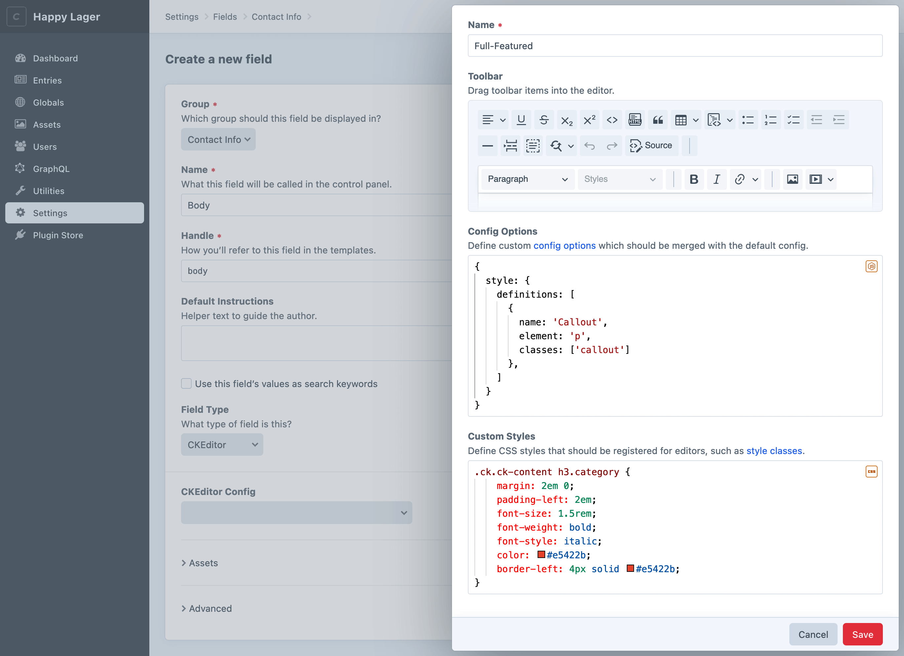

<p align="center"></p>

<h1 align="center">CKEditor</h1>

This plugin adds a “CKEditor” field type to Craft CMS, which provides a deeply-integrated rich text editor, powered by [CKEditor 5](https://ckeditor.com/).


## Requirements

This plugin requires Craft CMS 4.4.7 or later.

## Installation

You can install this plugin from the Plugin Store or with Composer.

#### From the Plugin Store

Go to the Plugin Store in your project’s Control Panel and search for “CKEditor”. Then click on the “Install” button in its modal window.

#### With Composer

Open your terminal and run the following commands:

```bash
# go to the project directory
cd /path/to/my-project.test

# tell Composer to load the plugin
composer require craftcms/ckeditor

# tell Craft to install the plugin
./craft plugin/install ckeditor
```

## Configuration

CKEditor configs are managed globally from **Settings** → **CKEditor**.

Configurations define the available toolbar buttons, as well as any custom [config options](https://ckeditor.com/docs/ckeditor5/latest/api/module_core_editor_editorconfig-EditorConfig.html) and CSS styles that should be regisered with the field.

New configs can also be created inline from CKEditor field settings.



### Registering Custom Styles

CKEditor’s [Styles](https://ckeditor.com/docs/ckeditor5/latest/features/style.html) plugin makes it easy to apply custom styles to your content via CSS classes.

You can define custom styles within CKEditor configs using the [`style`](https://ckeditor.com/docs/ckeditor5/latest/api/module_core_editor_editorconfig-EditorConfig.html#member-style) config option:

```js
return {
  style: {
    definitions: [
      {
        name: 'Tip',
        element: 'p',
        classes: ['note']
      },
      {
        name: 'Warning',
        element: 'p',
        classes: ['note', 'note--warning']
      },
    ]
  }
}
```

You can then register custom CSS styles that should be applied within the editor when those styles are selected:

```css
.ck.ck-content p.note {
    border-left: 4px solid #4a7cf6;
    padding-left: 1rem;
    color: #4a7cf6;
}

.ck.ck-content p.note--warning {
    border-left-color: #e5422b;
    color: #e5422b;
}
```

### HTML Purifier Configs

CKEditor fields use [HTML Purifier](http://htmlpurifier.org) to ensure that no malicious code makes it into its field values, to prevent XSS attacks
and other vulnerabilities.

You can create custom HTML Purifier configs that will be available to your CKEditor fields. They should be created as JSON files in
your `config/htmlpurifier/` folder.

Use this as a starting point, which is the default config that CKEditor fields use if no custom HTML Purifier config is selected:

```json
{
  "Attr.AllowedFrameTargets": [
    "_blank"
  ],
  "Attr.EnableID": true
}
```

See the [HTML Purifier documentation](http://htmlpurifier.org/live/configdoc/plain.html) for a list of available config options.

### Embedding Media

CKEditor 5 stores references to embedded media embeds using `oembed` tags. Craft CMS configures HTML Purifier to support these tags, however you will need to ensure that the `URI.SafeIframeRegexp` HTML Purifier setting is set to allow any domains you wish to embed content from. 

See CKEditor’s [media embed documentation](https://ckeditor.com/docs/ckeditor5/latest/features/media-embed.html#displaying-embedded-media-on-your-website) for examples of how to show the embedded media on your front end.

## Converting Redactor Fields

You can used the `ckeditor/convert` command to convert any existing Redactor fields over to CKEditor. For each unique Redactor config, a new CKEditor config will be created.

```sh
php craft ckeditor/convert
```
